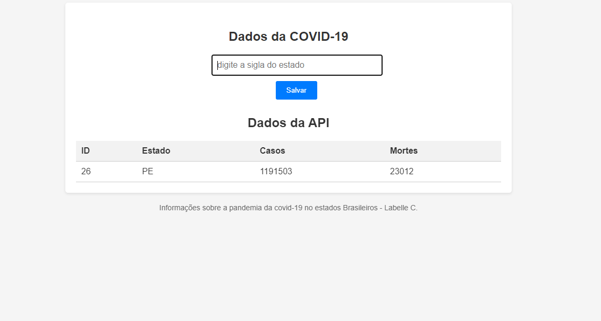
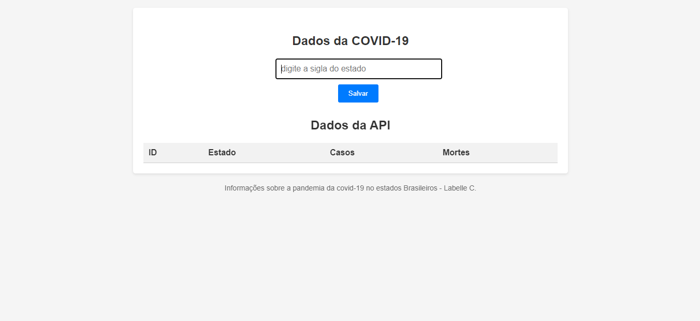

# Programa Web para consulta de dados da COVID-19 por estado.

  

#
# 🚀 Tecnologias:

- HTML
- CSS
- JavaScript
- API COVID-19: [https://covid19-brazil-api-docs.vercel.app/]

# Funcionalidades:

- Busca dados da COVID-19 por estado (casos e mortes).
- Exibe os dados em uma tabela organizada.

# Projeto:

O código-fonte deste projeto está disponível no GitHub:

* Link do repositório: URL do seu repositório

# Instruções de uso:

1. Clone o repositório para o seu computador.
2. Abra o arquivo `index.html` em um navegador web.
3. Insira a sigla do estado desejado no campo de texto.
4. Clique no botão "Buscar".
5. Os dados do estado serão exibidos na tabela.

# Exemplo:

Exemplo de uso do projeto: [https://es.wiktionary.org/wiki/removido](https://es.wiktionary.org/wiki/removido)

# Autora:

- Labelle Candido

# Agradecimentos:

- Agradecemos aos desenvolvedores da API COVID-19 por disponibilizar essa ferramenta valiosa.

# Links Úteis:

- API COVID-19: [https://covid19-brazil-api-docs.vercel.app/]

# Screenshots:

 

  
  

  

# Deploy:

- Projeto online: URL do seu projeto online

# Esperamos que este projeto seja útil!